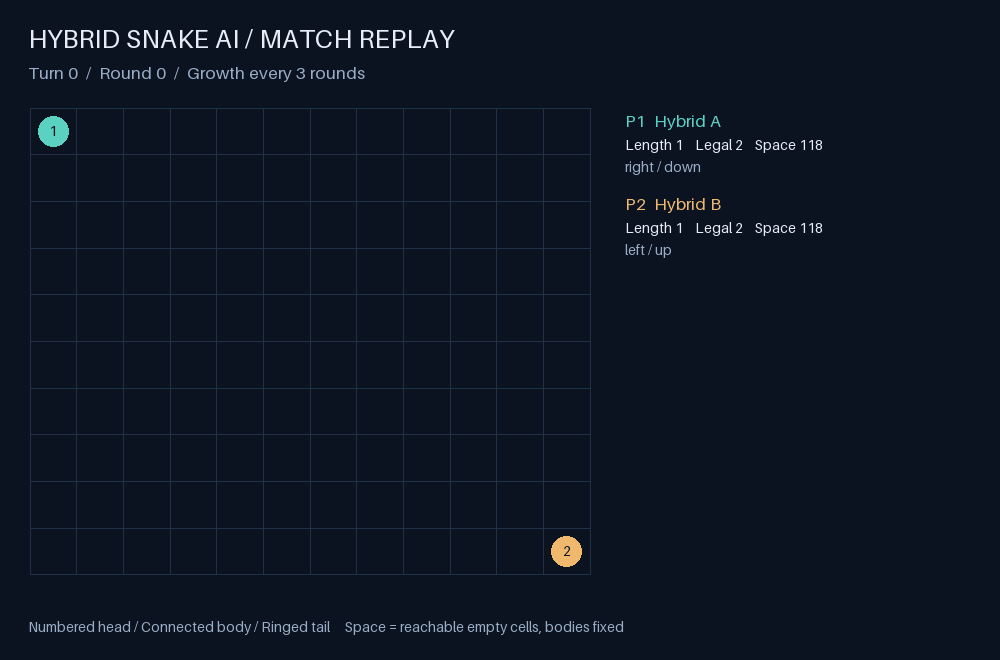
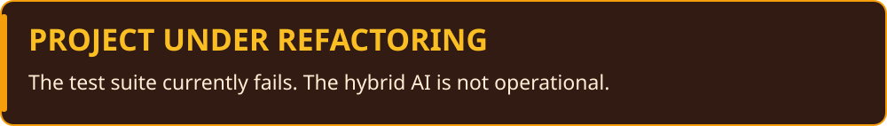
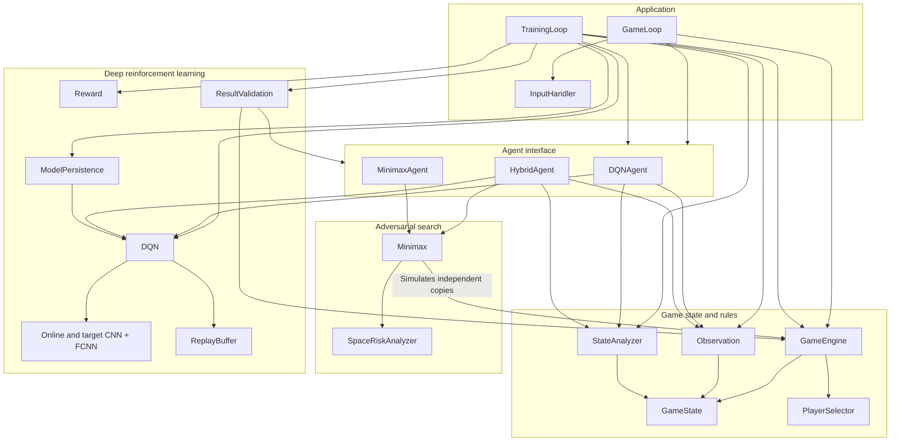

# Hybrid AI for Competitive Snake



*Illustrative hybrid match: two players grow every three rounds. An offensive
heuristic tries to cut off the opponent; six-ply Minimax checks survival and
rejects risky attacks. The animation shows which policy selected each move.

## Overview



This is an advanced AI system for playing a multiplayer Snake games to participate in the [INSAlgo Snake Competition](https://github.com/INSAlgo/Concours-Snake)

The project implements a combination of 2 AI approaches in C++ without using any external libraries:
1. **Minimax Algorithm with Alpha-Beta Pruning**  
   *Focus: Defense & Survival*
  - **Self-preservation:** Avoids self-blocking by ensuring safe moves.
  - **Defensive Search:** Evaluates moves to trap or force the opponent into a dangerous position.
  - **Dynamic Evaluation:** Adjusts search based on board size and game state.

2. **Deep Q-Learning (DQN) with Convolutional & Fully Connected Neural Networks**  
   *Focus: Offense & Adaptability*
  - **Risk-Taking:** Learns to exploit opportunities and take calculated risks.
  - **Adaptive Strategy:** Adapts to opponent behavior and varying map sizes.
  - **Feature Extraction:** Uses a CNN to visually process the game board and an FCNN to make decisions based on combined features.

---

## Key Features

- **Hybrid AI Strategies:**
  - **Minimax with Alpha-Beta Pruning:** Guarantees defensive play and trap-setting.
  - **Deep Q-Network (DQN):** Combines CNN for board analysis with FCNN for decision making.
  - **Hybrid Integration:** Leverages the strengths of both approaches for optimal performance.

- **Advanced Spatial Risk Analysis:**
  - Dynamic risk heatmaps and multi-source flood fill algorithms for area control.
  - Temporal-spatial risk assessment to evaluate movement dangers.

- **Sophisticated Reward System:**
  - Rewards based on space control, kill zone detection, and anti-passivity.
  - Tailored metrics that adjust for board size and dynamic game scenarios.

- **Robust Training & Validation Tools:**
  - Experience replay buffer for stable training.
  - Tools for saving/loading models and performance analytics.
  - Integrated validation routines to analyze victories, survival turns, rewards, Q-value consistency, and action entropy.

---

## Architecture

The diagram below summarizes the target architecture for the refactoring.
The complete class interfaces, ownership relationships and behavioral contracts
are defined in [ClassDiagram.puml](ClassDiagram.puml).
Arrows show component dependencies.



- **GameEngine** owns the authoritative `GameState` and applies movement,
  collisions, growth, deaths and turn scheduling. Search uses copied states and
  the same transition rules as real play.
- **Observation and StateAnalyzer** transform a state into board channels and
  ordered numerical features. `EncodedState` groups these inputs with the legal
  action mask; `Transition` stores a learning experience.
- **Agents** share a `selectAction` interface. `DQNAgent` uses learned Q-values,
  `MinimaxAgent` uses search scores, and `HybridAgent` combines their normalized
  scores over legal actions using `(1 - lambda) * minimaxScore + lambda * qValue`.
- **DQN** owns online and target networks plus its replay buffer. CNN features
  pass through global average pooling and are combined with extra features before
  the FCNN produces four action values.
- **TrainingLoop** orchestrates episodes, rewards, replay training, target-network
  updates, model persistence and validation. Agents borrow the learner's DQN.

---

## Project Structure

```
├── include/
│   ├── CNN.h               # Convolutional neural network
│   ├── FCNN.h              # Fully connected neural network
│   ├── Minimax.h           # Minimax algorithm with alpha-beta pruning
│   ├── NNAI.h              # Combination of CNN and FCNN for AI
│   ├── ReplayBuffer.h      # Replay buffer for deep Q-Learning
│   ├── SpaceRiskAnalyzer.h # Spatial risk assessment
│   ├── Structs.h           # Data structures
│   └── Utils.h             # Utility functions
├── src/
│   ├── CNN.cpp               # Implementation of a convolutional neural network
│   ├── FCNN.cpp              # Implementation of a fully connected neural network
│   ├── Minimax.cpp           # Implementation of a minimax algorithm with alpha-beta pruning
│   ├── NNAI.cpp              # Implementation of the combination of CNN and FCNN for AI
│   ├── ReplayBuffer.cpp      # Implementation of a replay buffer for deep Q-Learning
│   ├── SpaceRiskAnalyzer.cpp # Implementation of a spatial risk assessment class
│   └── Reward.cpp             # Implementation of utility functions
```

---

## Game State Representation

### Board State
The board is represented as a flattened 2D grid with **6 channels per cell**:
- **Channel 0:** My snake head
- **Channel 1:** My snake body
- **Channel 2:** Opponent snake head
- **Channel 3:** Opponent snake body
- **Channel 4:** X coordinate (normalized)
- **Channel 5:** Y coordinate (normalized)

### Extracted Features
- **Distance Metrics:**
  - For every opponent: Minimum, maximum, and average distances from my snake's head to the opponent’s body (normalized by max distance)
  - For every opponent: Minimum, maximum, and average distances from the opponent's head to my snake's body (normalized by max distance)
- **Growth Metrics:**
  - Growth speed
  - Rounds remaining until growth
  - Current snake size
- **Spatial Metrics:**
  - For every opponent: escape routes (normalized 0-1)
  - For every opponent: kill zone score (proximity to danger zones, normalized 0-1)
- **Behavioral Metrics:**
  - Phase-Based Aggression Coefficient (0-1)
  - action History Entropy (-1-1)

---

## Components

## SpaceRiskAnalyzer
SpaceRiskAnalyzer is a spatial risk assessment system for grid-based games that provides tools to evaluate spatial risks, 
available areas, and movement dangers in competitive grid environments like Snake.

### Features
- **Risk Heatmap Generation**: Calculates risk levels across the game grid based on how quickly different players can reach each cell
- **Space Accessibility Analysis**: Determines available movement space for each player using multi-source flood fill
- **Directional Risk Assessment**: Evaluates the danger of moving in specific directions
- **Efficient Caching**: Avoids redundant calculations by caching precomputed data

### Core Algorithms
- **Reach Timing Computation**: Uses BFS to calculate how many steps it takes each player to reach every cell
- **Multi-source Flood Fill**: Determines accessible areas and contested regions
- **Exponential Decay**: Applies decay to risk factors based on distance for more accurate risk assessment


### Minimax Algorithm
A classical AI approach designed for strategic defense.

- **Highlights:**
  - Alpha-beta pruning for efficient state search.
  - Evaluation functions that integrate spatial risk analysis.
  - Adaptive to varying board sizes and dynamic game conditions.

### Neural Network AI
Deep reinforcement learning approach:
- **CNN**: Processes the board state visually : 3x3 conv → maxpool → 3x3 conv
- **Feature Fusion**: Concatenates spatial + analytic features
- **FCNN**: Makes decisions based on extracted features and the output of the CNN : 64 → 32 → 4 FC layers with ReLU except the last one which is a linear layer
- **ReplayBuffer**: Implements experience replay for stable learning
- Training mechanisms with decay exploration rates


## Usage
The main.cpp file provide 3 different main functions:
- `gameMain` to play a game with the combination of both AI
- `trainingMain` to train the neural network AI
- `optimiseMain` to optimise the Minimax parameters


## todo:
- finish main.cpp
- finish optimise.cpp
- finish train.cpp

- optimise terminal state detection in Minimax (multiple methods and don't use the alive state)
- optimise Minimax using transition table

- 📈 performance benchmark
| Metric                | Minimax Only | DQN Only | Hybrid AI |
|-----------------------|--------------|----------|-----------|
| Win Rate (1v1)        | 0%           | 0%       | **0%**    |
| Decisions/sec         | 0            | 0        | 0         |
| Training Convergence  | N/A          | 0h       | 0h        |
